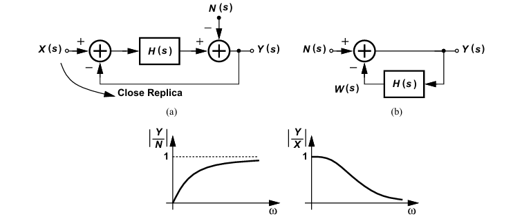

# Razavi

## Analysis and design of Data converter
### 21章  
オーバーサンプリング＋ノイズシェーピングによって帯域内ノイズを低減  
- オーバーサンプリングの効果  
例えば、fsを倍にすると、帯域内の量子化雑音は3dB減少する  
- ΔΣ変調による効果  
量子化雑音がノイズシェーピングされる  
雑音から見るとハイパス特性、入力信号から見るとローパス特性になる  

以下ノイズシェーピング解説

図よりノイズの伝達関数は以下のようになります。
$$
\frac{Y(s)}{N(s)} = \frac{1}{1+H(s)}
$$

$H(s)$ は積分器なので $H(s) = \frac{1}{s}$ となり、代入すると以下のようになります。
$$
\frac{Y(s)}{N(s)} = \frac{s}{1+s}
$$

したがって、それぞれ以下の特性を持つことがわかります。

**ノイズはハイパス特性**
$$
\frac{Y(s)}{N(s)} = \frac{s}{1+s}
$$

**入力信号はローパス特性**
$$
\frac{Y(s)}{X(s)} = \frac{1}{1+s}
$$

以下伝達関数がハイパス特性となる解説

$s=j\omega$ を代入すると、
$$
H(j\omega) = \frac{j\omega}{1+j\omega}
$$

振幅（絶対値）をとると、
$$
|H(j\omega)| = \frac{\omega}{\sqrt{1+\omega^2}}
$$

$\omega \to 0$ の時、
$$
|H(j\omega)| = 0
$$

$\omega \to \infty$ の時、
$$
|H(j\omega)| = 1
$$

上記より、高域になるほどゲインが1に近づくためハイパス特性となります。

---
予備知識
---
離散時間の積分と連続時間の積分
- 離散時間
$$
\frac{1}{1-z^{-1}}
$$
- 連続時間
$$
\frac{1}{s}
$$
